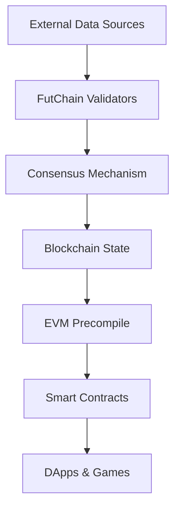

# ⚽ FutChain - Football Data Blockchain

> **Revolutionary blockchain that fetches live football data and provides it directly to EVM smart contracts without external oracles. Aims to join data source with consensus mechanism.**

[](https://golang.org)
[](https://github.com/cosmos/cosmos-sdk)

## 🚀 What is FutChain?

FutChain is a groundbreaking **football data oracle blockchain** that eliminates the need for traditional oracles by making the blockchain itself act as the data source. Built on Cosmos SDK with EVM compatibility, it fetches live football data from the internet and provides consensus-backed real-time sports data directly to smart contracts.

### 🎯 Key Innovation

**The blockchain IS the oracle** - Instead of relying on external oracle services, FutChain validators collectively fetch and validate football data, creating a trustless, decentralized sports data feed with built-in consensus. (WIP)

## ✨ Features

### 🔥 Core Capabilities
- **🌐 Native Data Fetching**: Blockchain automatically fetches live football data every 5 blocks
- **⚡ EVM Integration**: Direct access to live sports data from Solidity smart contracts: `0x0000000000000000000000000000000000000807`
- **🔒 Consensus-Backed**: All data is validated through blockchain consensus
- **📊 Real-time Updates**: Live match scores, status, and timing information
- **🏆 Multi-League Support**: Supports multiple football leagues and tournaments
- **🎮 Gaming Ready**: Perfect foundation for sports betting and fantasy games

### 📈 Data Types
- **Matches**: Live scores, status, timing, team information
- **Leagues**: Tournament and competition data
- **Teams**: Team information and statistics
- **Live Events**: Real-time match events and updates

## 🏗️ Architecture

### Consensus-Driven Data Oracle



### 🔄 Data Flow Process

1. **Automatic Fetching**: Every 5 blocks (`FetchModulo = 5`), validators fetch data from external sources
2. **Consensus Validation**: Multiple validators validate the fetched data
3. **State Updates**: Only changed data is stored on-chain for efficiency
4. **EVM Access**: Smart contracts access data through precompiled contracts
5. **Real-time Gaming**: DApps get instant access to live, consensus-backed sports data without relaying any external data sources. Everything stored in-chain, accessible from EVM.

### 🛠️ Technical Stack

- **Blockchain**: Cosmos SDK v0.53.x
- **EVM**: cosmos/evm module (v0.4.x) for Ethereum compatibility. Fork of evm/evmd.
- **Consensus**: Tendermint BFT, data aggregation
- **Smart Contracts**: Solidity with custom precompiles

## 🚀 Quick Start

### Prerequisites
- Go 1.24+
- Git

### 🏃‍♂️ Running the Chain

1. **Clone the repository**
```bash
git clone https://github.com/raifpy/futchain.git
cd futchain
```

2. **Start the local node**
```bash
./local_node.sh -y
```

3. **Connect to the chain**
- **RPC URL**: `http://localhost:8545`
- **Chain ID**: `cosmos_262144-1`
- **Currency**: `atest`

### 🔗 Connect Your Wallet

Use this seed phrase for testing:
```
gesture inject test cycle original hollow east ridge hen combine junk child bacon zero hope comfort vacuum milk pitch cage oppose unhappy lunar seat
```

**Metamask Setup:**
1. Add custom network with RPC URL: `http://localhost:8545`
2. Chain ID: `262144`
3. Currency Symbol: `ATEST`

## 💻 Smart Contract Integration

### 🎯 Base Contract (`base.sol`)

FutChain provides a complete Solidity interface for accessing live football data. Here's the full `base.sol` contract:

```solidity
pragma solidity >=0.8.17;

address constant FUTAPP_PRECOMPILE_ADDRESS = 0x0000000000000000000000000000000000000807;

// Futchain Data Structures
struct MatchData {
    uint256 id;
    uint256 leagueId;
    string name;
    string time;
    uint256 homeId;
    uint256 awayId;
    uint256 homeScore;
    uint256 awayScore;
    string homeName;
    string awayName;
    bool started;
    bool finished;
    bool cancelled;
}

struct LeagueData {
    uint256 id;
    string name;
    string groupName;
}

struct TeamData {
    uint256 id;
    string name;
}

// Futchain Interface Contract
interface FutI {
    /// @notice Get match details by ID
    /// @param matchId The match ID to query
    /// @return match The match data structure
    function getMatch(uint256 matchId) external view returns (MatchData memory);
    
    /// @notice Get league details by ID
    /// @param leagueId The league ID to query
    /// @return league The league data structure
    function getLeague(uint256 leagueId) external view returns (LeagueData memory);
    
    /// @notice Get team details by ID
    /// @param teamId The team ID to query
    /// @return team The team data structure
    function getTeam(uint256 teamId) external view returns (TeamData memory);
    
    /// @notice Get list of unfinished match IDs
    /// @return matchIds Array of unfinished match IDs
    function getUnfinishedMatches() external view returns (uint256[] memory);
}

// Futchain Precompile Instance
FutI constant FUTCHAIN = FutI(FUTAPP_PRECOMPILE_ADDRESS);
```

### 🎮 Example Usage

```solidity
pragma solidity >=0.8.17;

import "./base.sol";

contract FootballGame {
    // Access live football data
    function getMatchInfo(uint256 matchId) public view returns (MatchData memory) {
        return FUTCHAIN.getMatch(matchId);
    }
    
    function createBet(uint256 matchId, uint256 homeScore, uint256 awayScore) public {
        MatchData memory match = FUTCHAIN.getMatch(matchId);
        require(!match.started, "Match already started");
        require(!match.finished, "Match already finished");
        
        // Your betting logic here
        // Data is live and consensus-backed!
    }
    
    function getLiveMatches() public view returns (uint256[] memory) {
        return FUTCHAIN.getUnfinishedMatches();
    }
}
```

### 📋 Available Functions

```solidity
interface FutI {
    function getMatch(uint256 matchId) external view returns (MatchData memory);
    function getLeague(uint256 leagueId) external view returns (LeagueData memory);
    function getTeam(uint256 teamId) external view returns (TeamData memory);
    function getUnfinishedMatches() external view returns (uint256[] memory);
}
```

### 📊 Data Structures

```solidity
struct MatchData {
    uint256 id;
    uint256 leagueId;
    string name;           // "Team A - Team B"
    string time;           // "09.09.2025 20:45"
    uint256 homeId;
    uint256 awayId;
    uint256 homeScore;
    uint256 awayScore;
    string homeName;
    string awayName;
    bool started;
    bool finished;
    bool cancelled;
}
```

## 🧪 Testing

### Test the Precompile

```bash
cd x/futchain/contracts
npm install
node test_futchain_precompile.js
```

Expected output:
```
🔗 Testing connection...
✅ Connected to chain 262144, block 1234

🏈 Testing getMatch(1)...
✅ Match data received:
  📊 Match Details:
    ID: 1
    League ID: 47
    Name: Manchester United - Liverpool
    Time: 15.12.2024 16:30
  🏠 Home Team: Manchester United (Score: 2)
  🚀 Away Team: Liverpool (Score: 1)
  ⚽ Status: Started: true, Finished: false
```

## 🎮 Use Cases

### 🎲 Sports Betting
Create trustless betting platforms with real-time, consensus-backed odds and results.

### 🏆 Fantasy Sports
Build fantasy leagues with live player performance data and automated scoring.

### 🎯 Prediction Markets
Develop prediction markets for match outcomes with instant settlement.

### 📊 Sports Analytics
Access historical and live data for advanced sports analytics applications.

## 🔧 Development

### 🏗️ Building from Source

```bash
# Install dependencies
go mod download

# Build the binary
make build

# Run tests
make test
```


### ⚙️ Configuration

Key parameters in `x/futchain/types/params.go`:
- `FetchModulo`: How often to fetch data (default: every 5 blocks)
- `Timezone`: Timezone for data fetching (default: "Europe/Istanbul")

## 🛣️ Roadmap

### 🎯 Current Status: Demo/Showcase
- ✅ Basic football data fetching
- ✅ EVM precompile integration
- ✅ Consensus mechanism
- ✅ Real-time match updates

### 🚀 Development Roadmap

#### 🔄 Phase 1: Enhanced Consensus & Data Sources
- [ ] **Multiple Data Sources Integration**: Integrate additional sports data providers with consensus mechanism
- [ ] **True Consensus Mechanism**: Implement validator consensus over multiple data sources
- [ ] **Data Source Validation**: Cross-validation between multiple providers

#### 🎮 Phase 2: Multi-Game & Event Support  
- [ ] **Multiple Game Support**: Expand beyond football (basketball, tennis, etc.)
- [ ] **Multiple Event Types**: Support various event types (goals, cards, substitutions, etc.)
- [ ] **Real-time Event Streaming**: Live event updates with detailed match events

#### 🏛️ Phase 3: Enhanced Governance & Security
- [ ] **Enhanced Government Module Support**: Advanced governance for data source management
- [ ] **Enhanced Slashing Module Support**: Penalties for malicious or incorrect data provision
- [ ] **Validator Incentives**: Reward system for accurate data provision

#### 🌐 Phase 4: Interoperability & Streaming
- [ ] **IBC Support**: Inter-blockchain communication for cross-chain sports data
- [ ] **EVM Event Streaming Support**: Real-time event streaming to EVM contracts
- [ ] **Cross-chain Gaming**: Enable sports gaming across multiple blockchains

#### 🔒 Phase 5: Production Readiness
- [ ] **Security Audits**: Comprehensive security reviews
- [ ] **Performance Optimization**: High-throughput data processing
- [ ] **Monitoring & Analytics**: Advanced monitoring and data analytics tools

## ⚠️ Important Notice

**This is a demonstration project and is NOT production-ready.** 

Current limitations:
- Single data source
- No actualy consensus mechanism since single data source
- Basic security measures
- Limited error handling

